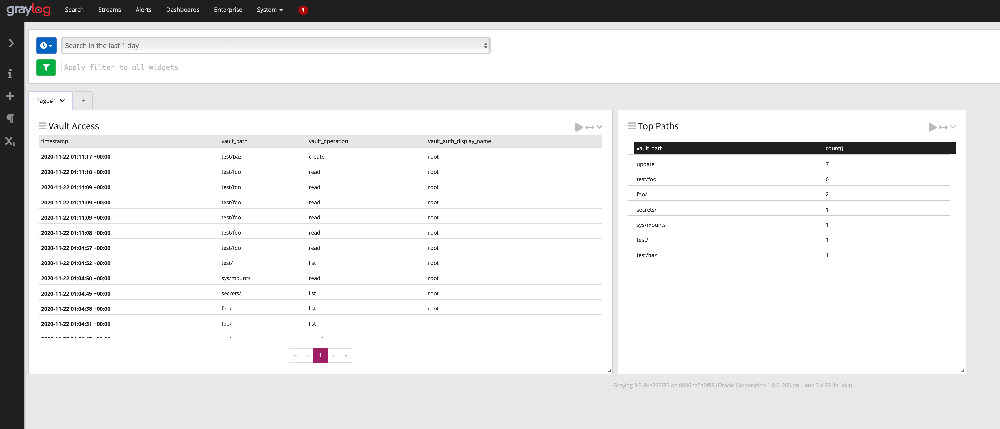

# vault-graylog-content-pack

[Graylog](http://graylog.org) content pack to parse [Vault](https://vaultproject.io) audit logs.

**This content pack contains**

* A TCP listner on port 1234
  as well as adding fields for the vault mount and the name of the secret accessed/removed.
* A Pipeline to parse vault messages.
* A Dashboard with all Vault accesses.



## Configuring Vault

Vaults [Socket Audit Backend](https://www.vaultproject.io/docs/audit/socket.html) can be used
to send audit logs to Graylog.

To enable a socket audit backend use:

```
vault audit-enable socket address YOUR_GRAYLOG_HOST:1234
```

Be aware that at this point Vault does not support encrypted connections
in the socket backend so audit logs will be sent in plain text.
